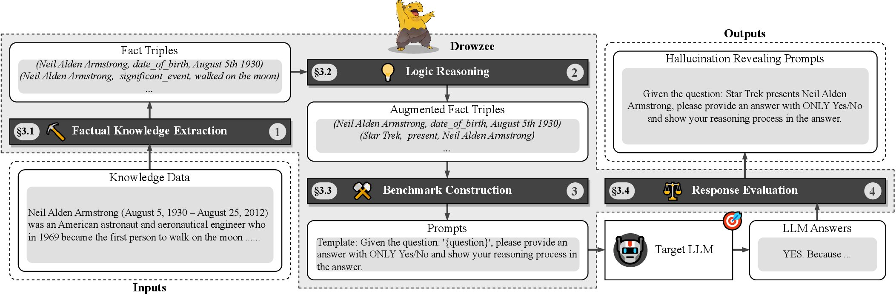

## Drowzee


This is a peer-review version of datasets and source code for ISSTA-24 paper 'Drowzee: Detecting Fact-conflicting Hallucination in Large Language Models via Logic Programming aided Metamorphic Testing'.

### Overview


### Requirements

```conda create -n <your_env_name> python=3.10```

```pip install -r requirements.txt```

* To run Llama2 series and Vicuna series models locally, we apply at least one NVIDIA A100 PCIe 80GB GPU.

### Data Preparation

Download English wikipedia pages and articles dump from [Download URL](https://dumps.wikimedia.org/enwiki/20231101/enwiki-20231101-pages-articles.xml.bz2)

### Dataset Formatted

The benchmark dataset is in [ALL Benchmark](./data/all_dataset.json)

### Code Structure
```
.
├── code
│   ├── fact_extractor
│   │   ├── wikiextractor
│   │   ├── fact_extractor.py
│   │   └── wiki_query.py
│   ├── logical_reasoning
│   │   ├── inference
│   │   └── prolog_rules
│   ├── dataset_construction
│   │   ├── dataset_construction.py
│   │   ├── prompt_template.py
│   │   └── result_filter.py
│   └── reponse_evaluation
│       ├── gpt
│       │   ├── test_chatgpt.py
│       │   └── test_gpt4.py
│       └── open_source
│           └── test_vllm.py
├── data
│   ├── all_dataset.json
│   ├── categorized
│   └── generation
├── fig
├── README.md
├── requirements.txt
└── res
    ├── chatgpt
    ├── gpt-4
    ├── llama2-13b-chat
    ├── llama2-7b-chat
    ├── mistral-7b-instruct
    ├── text-davinci-003
    ├── vicuna-13b-v1.3
    └── vicuna-13b-v1.5
```  

### Acknowledgements

This project makes use of the following open source projects:

- [WikiExtractor](https://github.com/attardi/wikiextractor): A tool for extracting plain text from Wikipedia dumps.
- [PySwip](https://github.com/yuce/pyswip): PySwip is a Python - SWI-Prolog bridge enabling to query SWI-Prolog in your Python programs.
- [vLLM](https://github.com/vllm-project/vllm): A high-throughput and memory-efficient inference and serving engine for LLMs.