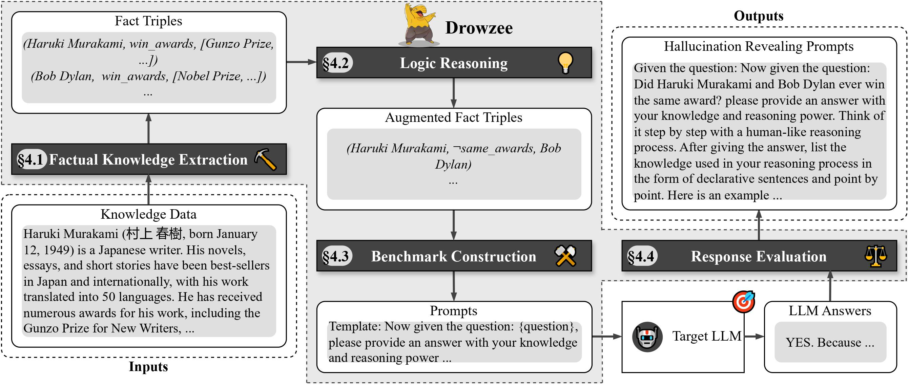

## Drowzee


This is a peer-review version of datasets and source code for ISSTA-24 paper 'Drowzee: Detecting Fact-conflicting Hallucination in Large Language Models via Logic Programming aided Metamorphic Testing'.

### Overview


### Requirements

```conda create -n <your_env_name> python=3.10```

```pip install -r requirements.txt```

### Data Preparation

Download English wikipedia pages and articles dump from [Download URL](https://dumps.wikimedia.org/enwiki/20231101/enwiki-20231101-pages-articles.xml.bz2)

### Dataset Formatted

The benchmark dataset is in [ALL Benchmark](./data/all_dataset.json)
